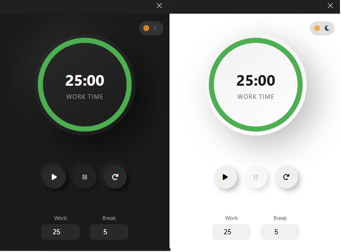

## Technologies Used

*   **HTML:** For structuring the extension's popup UI.
*   **CSS:** For styling the UI.
*   **JavaScript:** For the timer logic, handling user interactions, and notifications.

## How to Install

1.  **Download the Extension:** 
    *   If you're using the packaged extension (.crx file), you can drag and drop the file into your chrome extensions page.
    *  If you have the extension code locally, go to `chrome://extensions/` in your browser and enable "Developer mode" in the top right corner. Then click "Load unpacked" and select the folder where the extension code resides.
2.  **Enable the Extension:** Once installed, the extension icon (usually a camera or screen icon) will appear in your browser toolbar.

## Contributing

Contributions are welcome! Here's how you can contribute:

1.  **Fork the repository:** Create your own fork of this repository.
2.  **Create a branch:** Make your changes in a new branch.
3.  **Commit your changes:** Commit your changes with descriptive commit messages.
4.  **Push your branch:** Push your branch to your fork.
5.  **Create a pull request:** Submit a pull request to the main repository.

## Future Enhancements

*   **Persistent Settings:** Save custom work and break times using local storage.
*   **Task Integration:** Allow users to integrate with task management tools.
*   **Theme Customization:** Let users customize the look and feel of the timer.
*   **Sound Notifications:** Include sound alerts in addition to or instead of visual notifications.
*   **Statistics:** Track completed work and break sessions.
*   **More Robust Error Handling:** Add validation to inputs.

## License

This project is licensed under the [MIT License](LICENSE.txt). You are free to use and modify this code for your own projects, but proper attribution is required.

## Contact

If you have any questions or feedback, feel free to reach out. You can also submit issues in this repository.
